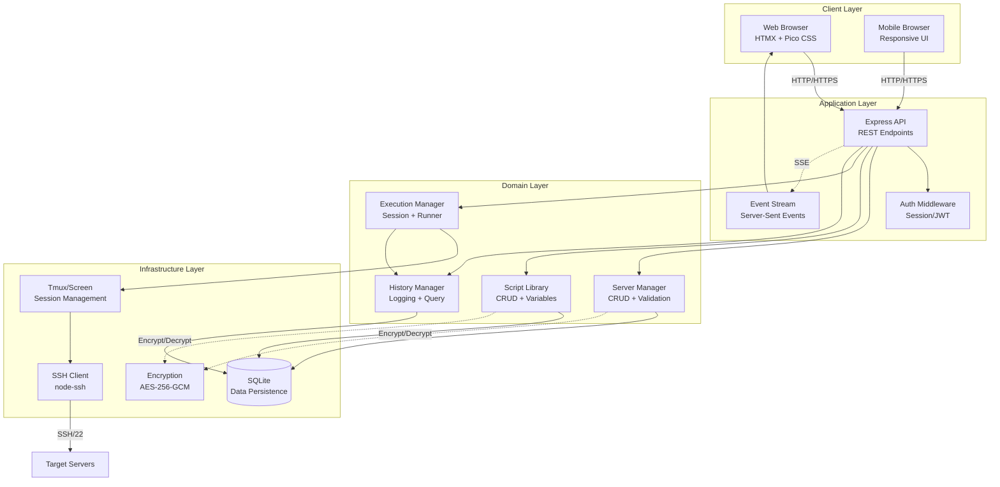
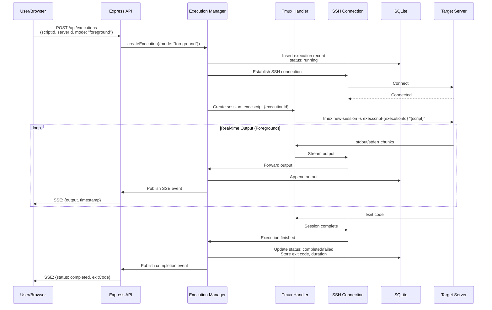
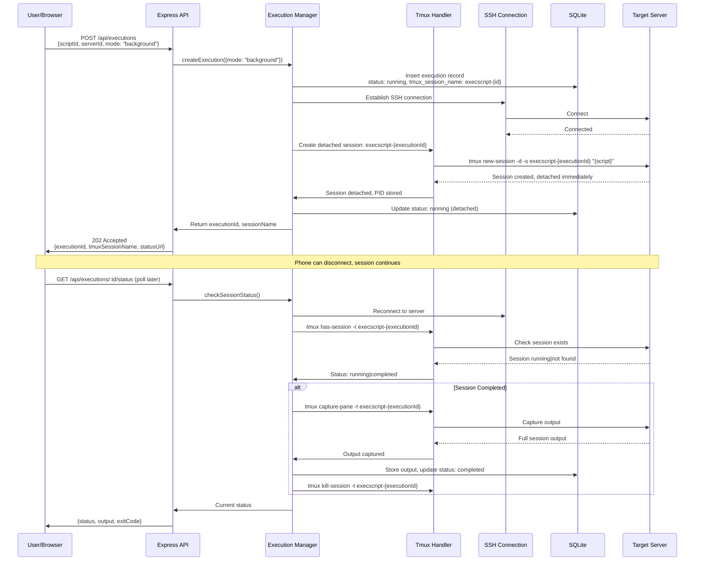
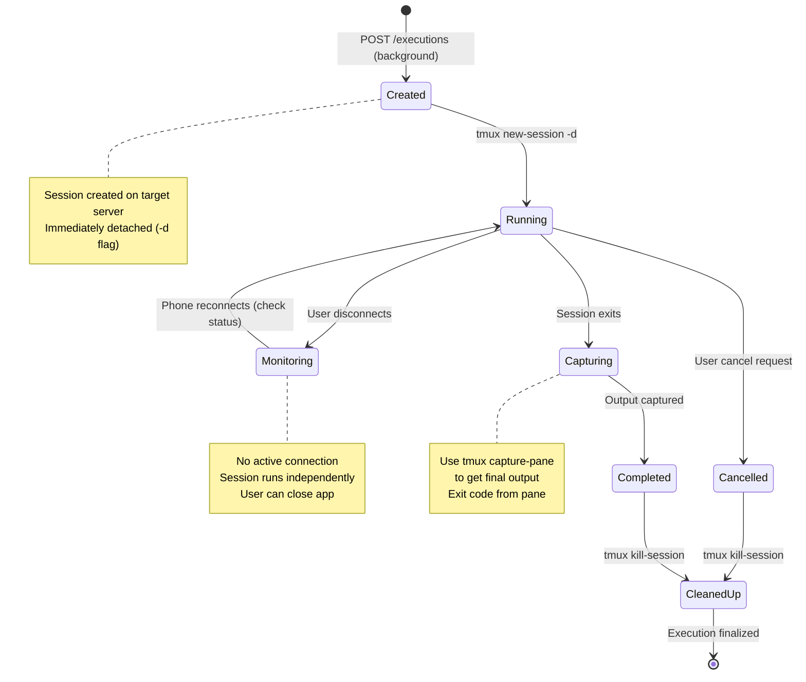
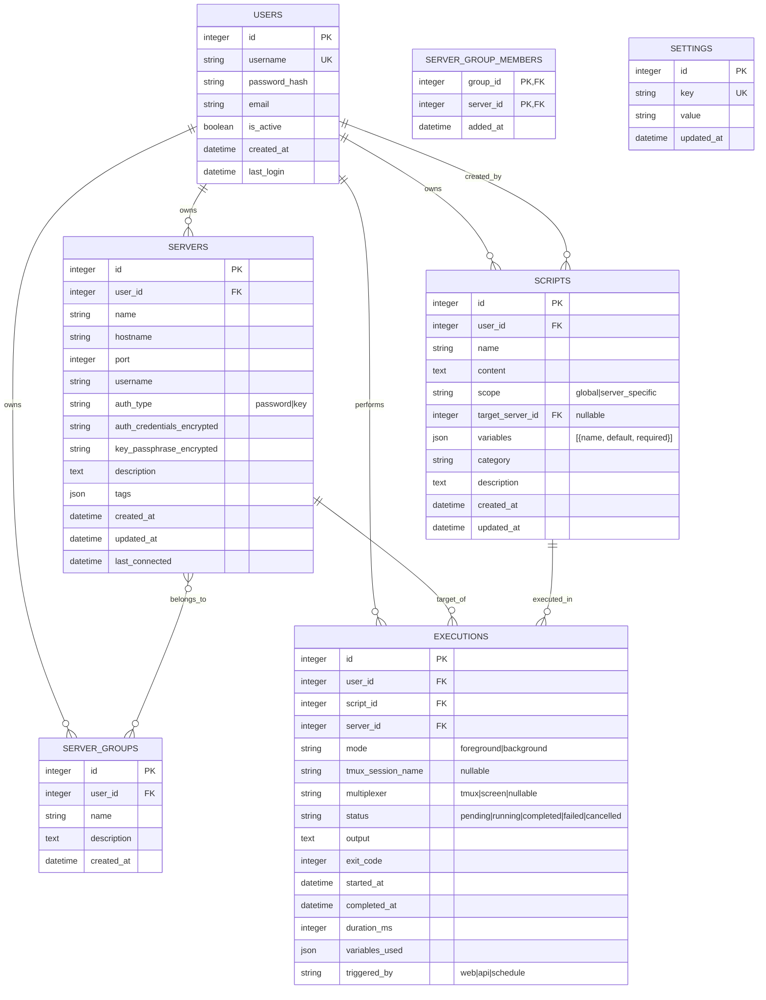

# ADR 001: ExecScript Web Architecture

## Status
Proposed

## Date
2026-02-19

## Context

ExecScript is a web-based Linux server administration tool that enables administrators to:
1. Maintain an inventory of Linux servers (SSH access via password or key)
2. Create a library of shell scripts (reusable across servers OR server-specific)
3. Execute scripts remotely via one-click from web/mobile interface
4. View execution history and output in real-time

This ADR documents the system architecture, technology choices, security model, and API contracts for the web-based implementation.

---

## 1. Component Architecture

### 1.1 High-Level Component Diagram



### 1.2 Component Boundaries

| Component | Responsibility | Interface |
|-----------|---------------|-----------|
| **Web Frontend** | Render UI, handle user interactions, display real-time output | HTMX attributes, SSE EventSource |
| **API Layer** | HTTP endpoints, request validation, response formatting | REST JSON |
| **Auth Service** | Session management, password hashing, access control | Middleware functions |
| **Server Manager** | Server CRUD, connection testing, credential handling | Internal service calls |
| **Script Library** | Script CRUD, variable substitution, categorization | Internal service calls |
| **Execution Manager** | Manage execution modes (foreground/background), tmux/screen session lifecycle | SSH + tmux/screen commands |
| **History Manager** | Log executions, query history, output retrieval | Internal service calls |
| **SSH Executor** | Establish connections, execute commands, manage persistent sessions | SSH2 protocol |
| **Tmux/Screen Handler** | Create, monitor, and capture output from detached sessions | Terminal multiplexers |
| **Encryption Service** | Credential encryption/decryption with master key | AES-256-GCM |

### 1.3 Data Flow: Script Execution (Foreground Mode)



### 1.4 Data Flow: Script Execution (Background Mode)



---

## 2. Execution Modes

### 2.1 Foreground Mode (Synchronous)

Foreground mode is designed for quick commands that complete within seconds:

**Use Cases:**
- Service status checks (`systemctl status nginx`)
- Quick restarts (`systemctl restart redis`)
- Reading logs (`tail -50 /var/log/syslog`)
- File operations (`df -h`, `free -m`)

**Characteristics:**
- HTTP connection maintained throughout execution
- Real-time output streaming via SSE
- Blocks until script completes (or timeout)
- Suitable for commands < 60 seconds
- Auto-reconnect on mobile network interruption (SSE)

**API Behavior:**
```javascript
// POST /api/executions
{
  scriptId: 1,
  serverId: 5,
  mode: "foreground",  // Explicit foreground mode
  timeout: 60          // Optional timeout in seconds (default: 60)
}

// Response: 200 OK
{
  id: 101,
  status: "running",
  mode: "foreground",
  streamUrl: "/api/v1/executions/101/stream"
}
```

### 2.2 Background Mode (Asynchronous with Tmux/Screen)

Background mode launches scripts in persistent terminal sessions that survive disconnections:

**Use Cases:**
- System updates (`apt update && apt upgrade`)
- Backups (`mysqldump`, `tar` operations)
- Log processing (large file analysis)
- Software builds and deployments
- Long-running maintenance tasks

**Characteristics:**
- Session created and immediately detached
- HTTP returns immediately (202 Accepted)
- Script continues even if phone disconnects
- Check back later to retrieve results
- No battery drain from maintaining connection

**Session Management:**
```javascript
// POST /api/executions
{
  scriptId: 2,
  serverId: 5,
  mode: "background",  // Background mode with tmux
  sessionType: "tmux"  // "tmux" or "screen"
}

// Response: 202 Accepted
{
  id: 102,
  status: "running",
  mode: "background",
  tmuxSessionName: "execscript-102",
  statusUrl: "/api/v1/executions/102",
  message: "Script running in background. Check back later for results."
}
```

---

## 3. Tmux/Screen Session Management

### 3.1 Session Naming Convention

All tmux/screen sessions follow a consistent naming pattern for easy identification and management:

```bash
# Session name format
execscript-{executionId}

# Examples:
execscript-102
execscript-1057
execscript-12345
```

**Rationale:**
- Prefix prevents collision with user sessions
- Execution ID ensures uniqueness
- Easy to filter and list ExecScript sessions
- Simple to associate with execution records

### 3.2 Session Lifecycle



### 3.3 Checking Session Status

To check if a background session is still running:

**Tmux:**
```bash
# Check if session exists
tmux has-session -t execscript-{executionId} 2>/dev/null

# Returns: 0 if running, 1 if not found

# List all execscript sessions
tmux list-sessions | grep "^execscript-"

# Get session info
tmux list-sessions -F "#{session_name}:#{session_created}:#{session_activity}" | grep "^execscript-"
```

**Screen:**
```bash
# Check if session exists
screen -S execscript-{executionId} -Q select . 2>/dev/null

# List all screen sessions
screen -list | grep "execscript-"

# Returns: No screen session found if not running
```

**Node.js Implementation:**
```javascript
class TmuxSessionManager {
  async isSessionRunning(sessionName) {
    try {
      await this.ssh.execCommand(`tmux has-session -t ${sessionName}`);
      return true;
    } catch (error) {
      return false;  // Session doesn't exist
    }
  }

  async listExecScriptSessions() {
    const result = await this.ssh.execCommand(
      "tmux list-sessions | grep '^execscript-' || true"
    );
    return result.stdout
      .split('\n')
      .filter(line => line.trim())
      .map(line => {
        const match = line.match(/^(execscript-\d+):/);
        return match ? match[1] : null;
      })
      .filter(Boolean);
  }
}
```

### 3.4 Capturing Output from Completed Sessions

When a background session completes, capture its output before cleanup:

**Tmux Output Capture:**
```bash
# Capture entire scrollback buffer
tmux capture-pane -t execscript-{executionId} -S - -E - -p

# Flags:
# -S - : Start from beginning of history (- = all)
# -E - : End at current position
# -p : Print to stdout instead of buffer

# Get exit code from last pane command
tmux display-message -t execscript-{executionId} -p "#{pane_dead_status}"
```

**Screen Output Capture:**
```bash
# Dump screen buffer to file, then read
screen -S execscript-{executionId} -X hardcopy /tmp/execscript-{executionId}.log
cat /tmp/execscript-{executionId}.log

# Note: screen -X doesn't return exit codes directly
# Use wrapper script to capture exit code
```

**Node.js Implementation:**
```javascript
class TmuxSessionManager {
  async captureSessionOutput(sessionName) {
    // Capture full output from pane
    const outputResult = await this.ssh.execCommand(
      `tmux capture-pane -t ${sessionName} -S - -E - -p`
    );

    // Get exit code (pane_dead_status returns empty if still running)
    const exitCodeResult = await this.ssh.execCommand(
      `tmux display-message -t ${sessionName} -p "#{pane_dead_status}" 2>/dev/null || echo ""`
    );

    // Parse exit code (tmux returns empty string for running sessions)
    const exitCode = exitCodeResult.stdout.trim() === '' 
      ? null 
      : parseInt(exitCodeResult.stdout.trim(), 10);

    return {
      output: outputResult.stdout,
      exitCode,
      isRunning: exitCode === null
    };
  }

  async killSession(sessionName) {
    try {
      await this.ssh.execCommand(`tmux kill-session -t ${sessionName}`);
      return true;
    } catch (error) {
      console.warn(`Failed to kill session ${sessionName}:`, error.message);
      return false;
    }
  }
}
```

### 3.5 Session Creation Commands

**Tmux Session Creation:**
```bash
# Create detached session with script
tmux new-session -d -s execscript-{executionId} \
  "cd {workingDir} && ({scriptContent}) 2>&1; echo \"\n[EXECSCRIPT_EXIT:$?]\""

# Features:
# -d: Detach immediately
# -s: Session name
# - 2>&1: Redirect stderr to stdout
# - [EXECSCRIPT_EXIT:$?]: Marker for exit code extraction
```

**Screen Session Creation:**
```bash
# Create detached session
screen -dmS execscript-{executionId} bash -c \
  "cd {workingDir} && ({scriptContent}) 2>&1; echo \"\n[EXECSCRIPT_EXIT:$?]\""

# Flags:
# -d: Detach
# -m: Create even if already attached elsewhere
# -S: Session name
```

### 3.6 Technology Decision: Tmux vs Screen

| Feature | Tmux | Screen |
|---------|------|--------|
**Availability** | Modern distros | Universal (legacy systems)
**Output capture** | Built-in capture-pane | Hardcopy to file
**Exit code** | #{pane_dead_status} | Requires wrapper script
**Pane management** | Multiple panes | Single window
**API/scripting** | Rich command set | Limited
**Recommendation** | **Default** | Fallback for minimal systems

**Implementation Strategy:**
```javascript
class SessionManager {
  constructor(ssh, preferred = 'tmux') {
    this.ssh = ssh;
    this.preferred = preferred;
  }

  async detectAvailableMultiplexer() {
    // Check tmux first
    const tmuxCheck = await this.ssh.execCommand('which tmux');
    if (tmuxCheck.code === 0) return 'tmux';

    // Fall back to screen
    const screenCheck = await this.ssh.execCommand('which screen');
    if (screenCheck.code === 0) return 'screen';

    throw new Error('Neither tmux nor screen available on target server');
  }

  async createSession(sessionName, scriptContent, workingDir = '/tmp') {
    const multiplexer = await this.detectAvailableMultiplexer();

    if (multiplexer === 'tmux') {
      return this.createTmuxSession(sessionName, scriptContent, workingDir);
    } else {
      return this.createScreenSession(sessionName, scriptContent, workingDir);
    }
  }
}
```

---

## 4. Database Schema Design

### 4.1 Entity Relationship Diagram



### 4.2 Schema Rationale

- **USERS**: Single-user initially, but schema supports future multi-user. Password hashed with bcrypt.
- **SERVERS**: `auth_credentials_encrypted` stores either password or private key, encrypted with AES-256-GCM using a master key from environment.
- **SERVER_GROUPS**: Many-to-many relationship for executing scripts across multiple servers.
- **SCRIPTS**: `scope` field determines if script is reusable or tied to a specific server. `variables` JSON stores parameter definitions.
- **EXECUTIONS**: 
  - `mode`: Distinguishes foreground (synchronous) vs background (tmux) execution
  - `tmux_session_name`: Links execution to server-side session for background mode
  - `multiplexer`: Records which tool was used (tmux/screen) for output capture
  - Text fields suitable for SQLite; for high volume, output could be stored to filesystem with path reference.
- **SETTINGS**: Key-value store for application configuration (encryption key derivation, retention policies).

### 4.3 Indexes

```sql
-- Fast lookups by user
CREATE INDEX idx_servers_user ON servers(user_id);
CREATE INDEX idx_scripts_user ON scripts(user_id);
CREATE INDEX idx_executions_user ON executions(user_id);

-- Execution history queries
CREATE INDEX idx_executions_server ON executions(server_id);
CREATE INDEX idx_executions_script ON executions(script_id);
CREATE INDEX idx_executions_status ON executions(status);
CREATE INDEX idx_executions_started ON executions(started_at);
CREATE INDEX idx_executions_mode ON executions(mode);
CREATE INDEX idx_executions_session ON executions(tmux_session_name);

-- Search
CREATE INDEX idx_servers_name ON servers(name);
CREATE INDEX idx_scripts_name ON scripts(name);
```

---

## 5. Mobile-First Considerations

### 5.1 Network Interruption Handling

Mobile networks are inherently flaky. The tmux/screen-based architecture handles this naturally:

**Foreground Mode (Graceful Degradation):**
```javascript
// Client-side: SSE with auto-reconnect
const eventSource = new EventSource('/api/executions/101/stream');

let reconnectAttempts = 0;
const maxReconnectDelay = 30000; // Max 30s between attempts

eventSource.onerror = () => {
  // Auto-reconnect with exponential backoff
  eventSource.close();
  
  if (reconnectAttempts < 10) {
    const delay = Math.min(1000 * Math.pow(2, reconnectAttempts), maxReconnectDelay);
    setTimeout(() => {
      reconnectAttempts++;
      // Reconnect to same endpoint
      const newES = new EventSource('/api/executions/101/stream');
      // ... attach handlers
    }, delay);
  }
};

// Server-side: Detect client disconnect
req.on('close', () => {
  // For foreground: Continue capturing output for 30s grace period
  // User can reconnect and resume streaming
});
```

**Background Mode (Resilient by Design):**
```javascript
// Background execution continues regardless of connection
// User can:
// 1. Start script on WiFi
// 2. Close app
// 3. Reopen hours later on different network
// 4. Poll for status: GET /api/executions/102/status

// Status check implementation
async function checkBackgroundStatus(executionId) {
  const execution = await getExecution(executionId);
  
  if (execution.mode === 'background' && execution.tmux_session_name) {
    const ssh = await connectToServer(execution.server_id);
    const sessionManager = new SessionManager(ssh);
    
    const isRunning = await sessionManager.isSessionRunning(execution.tmux_session_name);
    
    if (!isRunning && execution.status === 'running') {
      // Session ended, capture output
      const result = await sessionManager.captureSessionOutput(execution.tmux_session_name);
      await updateExecution(executionId, {
        status: result.exitCode === 0 ? 'completed' : 'failed',
        output: result.output,
        exit_code: result.exitCode,
        completed_at: new Date()
      });
      await sessionManager.killSession(execution.tmux_session_name);
    }
    
    return getExecution(executionId); // Return updated status
  }
}
```

### 5.2 Battery Life Preservation

**Problem:** Continuous SSE connections drain battery rapidly on mobile devices.

**Solution:** Background mode eliminates the need for persistent connections:

```javascript
// Client-side battery optimization
class ExecutionClient {
  async runScript(scriptId, serverId, estimatedDuration) {
    // For long-running scripts (> 30s estimated), prefer background
    const mode = estimatedDuration > 30 ? 'background' : 'foreground';
    
    const response = await this.api.post('/executions', {
      scriptId,
      serverId,
      mode
    });
    
    if (mode === 'background') {
      // No SSE connection needed
      // Show: "Running in background on server"
      // User can close app immediately
      return {
        executionId: response.id,
        checkBackIn: estimatedDuration,
        pollUrl: response.statusUrl
      };
    } else {
      // Foreground: Open SSE, but only for short duration
      return this.streamOutput(response.streamUrl);
    }
  }
}
```

**UX Patterns for Mobile:**
1. **Estimated Duration Indicator**: Scripts show estimated runtime; suggest background if > 30s
2. **One-Tap Background**: "Run in Background" prominent button for mobile
3. **Push Notifications**: Optional webhook/push when background execution completes
4. **Offline Queue**: Queue executions while offline, execute when connected

### 5.3 Quick vs Long-Running Task UX

**Quick Tasks (< 60 seconds):**
```
┌─────────────────────────────────────┐
│  Running: Check Service Status      │
├─────────────────────────────────────┤
│  ● nginx.service - A high per...    │
│    Loaded: loaded (/lib/systemd/... │
│    Active: active (running) since.. │
│                                     │
│  [Stop]                    3s │     │
└─────────────────────────────────────┘
```
- Live streaming output
- Cancel button available
- Progress indicator (time elapsed)

**Long-Running Tasks (> 60 seconds):**
```
┌─────────────────────────────────────┐
│  Running: System Update             │
├─────────────────────────────────────┤
│  ┌─────────────────────────────┐    │
│  │  Running in background      │    │
│  │  Server: web1.example.com   │    │
│  │  Started: 2 minutes ago     │    │
│  │                             │    │
│  │  [View Live Output]         │    │
│  │  [Check Status]             │    │
│  │                             │    │
│  │  You can close this app.    │    │
│  │  Session: execscript-102    │    │
│  └─────────────────────────────┘    │
└─────────────────────────────────────┘
```
- Immediate 202 response
- Session name displayed (for SSH verification)
- Check status button (polls server)
- View live output option (reattaches to tmux session)

---

## 6. Technology Recommendations

### 6.1 Decision Matrix

| Component | Option A | Option B | Decision | Rationale |
|-----------|----------|----------|----------|-----------|
| **Backend** | Node.js + Express | Python + FastAPI | **Node.js + Express** | Consistent with DayOfGeek.com stack; mature ecosystem; excellent async/await for streaming |
| **Database** | SQLite | PostgreSQL | **SQLite** | Single-user/small team focus; zero config; file-based backup; sufficient for expected scale |
| **SSH Library** | node-ssh | ssh2 (raw) | **node-ssh** | Higher-level API; Promise-based; built on ssh2; easier to maintain |
| **Frontend** | HTMX + Pico CSS | React/Vue SPA | **HTMX + Pico CSS** | Progressive enhancement; minimal JS; server-rendered; aligns with Exec Suite patterns |
| **Job Queue** | ~~Bull + Redis~~ | **Tmux/Screen** | **Tmux/Screen** | No infrastructure overhead; survives disconnections; mobile-friendly; uses tools sysadmins know |
| **Real-time** | Server-Sent Events | WebSocket | **SSE** | Unidirectional (server→client) fits output streaming; simpler than WebSocket; auto-reconnect |
| **Terminal Multiplexer** | Tmux | Screen | **Tmux (default)** | Better output capture API; modern; rich command set; fallback to screen if unavailable |

### 6.2 Trade-offs

#### Queue-Based (Bull/Redis) vs Tmux/Screen

**Queue-Based (Original Design):**
- **Pros**: Built-in retries, rate limiting, progress tracking, multiple workers
- **Cons**: Redis dependency, additional infrastructure, doesn't survive mobile disconnect

**Tmux/Screen (Revised Design):**
- **Pros**: 
  - Zero infrastructure beyond target server
  - Survives mobile network interruptions
  - Uses tools sysadmins already know
  - No battery drain from persistent connections
  - Simple deployment (single SQLite file)
- **Cons**: 
  - No built-in retry logic (handled at application layer)
  - Requires tmux/screen on target servers
  - Output capture requires session reattachment

**Decision**: Tmux/Screen is superior for mobile-first, personal tool use case.

#### Tmux vs Screen

**Tmux Pros:**
- Built-in output capture (`capture-pane`)
- Exit code accessible (`pane_dead_status`)
- Modern, actively maintained
- Better window/pane management

**Screen Pros:**
- Available on virtually all Linux systems
- Simpler command set
- Lower resource usage

**Decision**: Use tmux as default, with screen as fallback detection.

---

## 7. Authentication Strategy

### 7.1 Session-Based Authentication

```
┌─────────────┐      ┌─────────────┐      ┌─────────────┐
│   Browser   │      │   Express   │      │   SQLite    │
│             │      │   Session   │      │             │
└──────┬──────┘      └──────┬──────┘      └──────┬──────┘
       │                     │                     │
       │ POST /login         │                     │
       │ {username, password}│                     │
       │────────────────────>│                     │
       │                     │ bcrypt compare      │
       │                     │────────────────────>│
       │                     │<────────────────────│
       │                     │                     │
       │                     │ create session      │
       │                     │ (store in memory/DB)│
       │                     │                     │
       │ 200 + Set-Cookie:   │                     │
       │ connect.sid=xxx     │                     │
       │<────────────────────│                     │
       │                     │                     │
       │ Subsequent requests │                     │
       │ Cookie: connect.sid │                     │
       │────────────────────>│                     │
       │                     │ validate session    │
       │                     │────────────────────>│
       │                     │<────────────────────│
       │                     │                     │
       │ 200 Response        │                     │
       │<────────────────────│                     │
```

### 7.2 Security Implementation

| Aspect | Implementation |
|--------|---------------|
| **Password Storage** | bcrypt with cost factor 12 |
| **Session Storage** | express-session with SQLite store (better-sqlite3-session-store) |
| **Session Timeout** | 24 hours idle, 7 days absolute |
| **Cookie Security** | HttpOnly, Secure (HTTPS only), SameSite=Strict |
| **CSRF Protection** | csurf middleware for state-changing operations |
| **Rate Limiting** | express-rate-limit on auth endpoints (5 attempts per 15 min) |

### 7.3 SSH Credential Encryption

```
┌─────────────────────────────────────────────────────────┐
│                  Credential Encryption Flow              │
├─────────────────────────────────────────────────────────┤
│                                                          │
│  1. Master key derived from:                             │
│     - Environment variable EXECSCRIPT_MASTER_KEY         │
│     - Or key file specified in config                    │
│                                                          │
│  2. Per-credential encryption:                           │
│     - Generate random 256-bit DEK (Data Encryption Key)  │
│     - Encrypt credential with DEK using AES-256-GCM      │
│     - Encrypt DEK with Master Key using AES-256-KW       │
│     - Store: {encrypted_dek, encrypted_credential, nonce}│
│                                                          │
│  3. Decryption for SSH connection:                       │
│     - Decrypt DEK with Master Key                        │
│     - Decrypt credential with DEK                        │
│     - Pass to SSH library (never log, memory-zero after) │
│                                                          │
└─────────────────────────────────────────────────────────┘
```

---

## 8. Security Considerations

### 8.1 Threat Model & Mitigations

| Threat | Risk Level | Mitigation |
|--------|-----------|------------|
| **Credential Theft** | Critical | AES-256-GCM encryption at rest; master key in environment only; never log credentials |
| **Session Hijacking** | High | HttpOnly cookies, HTTPS only, SameSite=Strict, 24h timeout |
| **Command Injection** | Critical | No user input in shell commands; parameterized scripts only; whitelist validation |
| **SSH Key Exposure** | Critical | Private keys encrypted; passphrase protected; memory zero after use |
| **XSS via Script Output** | High | Output displayed as text (HTML escaped); base64 encoding for SSE |
| **CSRF** | Medium | csurf middleware for all state-changing POST/PUT/DELETE |
| **Brute Force Login** | Medium | Rate limiting (5 attempts per 15 min); exponential backoff |
| **DoS via Heavy Scripts** | Medium | Queue timeouts (5 min foreground, unlimited background); max output size limits |
| **Path Traversal in Scripts** | Medium | Validate script paths; sandbox file access; no user paths in scripts |
| **Tmux Session Hijacking** | Medium | Named sessions with execscript- prefix; cleanup after capture |

### 8.2 SSH Security Best Practices

```javascript
// SSH connection security configuration
const sshConfig = {
  host: server.hostname,
  port: server.port || 22,
  username: server.username,

  // Authentication
  ...(server.authType === 'password' && {
    password: decryptedPassword
  }),
  ...(server.authType === 'key' && {
    privateKey: decryptedKey,
    passphrase: decryptedPassphrase
  }),

  // Security hardening
  algorithms: {
    kex: ['curve25519-sha256', 'ecdh-sha2-nistp521'],
    cipher: ['aes256-gcm@openssh.com', 'aes128-gcm@openssh.com'],
    serverHostKey: ['ssh-ed25519', 'ecdsa-sha2-nistp521']
  },

  // Connection limits
  readyTimeout: 20000,        // 20s connection timeout
  keepaliveInterval: 30000,   // 30s keepalive
  keepaliveCountMax: 3        // Max 3 failed keepalives
};
```

### 8.3 Tmux Session Security

```javascript
// Security measures for tmux sessions
class SecureSessionManager {
  async createSecureSession(sessionName, scriptContent, workingDir) {
    // Validate session name to prevent injection
    const validName = /^execscript-\d+$/;
    if (!validName.test(sessionName)) {
      throw new Error('Invalid session name format');
    }

    // Escape script content for safe shell execution
    const escapedScript = this.escapeShellArg(scriptContent);

    // Create session in isolated environment
    const command = `tmux new-session -d -s "${sessionName}" \
      "cd ${this.escapeShellArg(workingDir)} && \
       (eval ${escapedScript}) 2>&1; \
       echo \"\n[EXECSCRIPT_EXIT:\$?]\""`;

    return this.ssh.execCommand(command);
  }

  escapeShellArg(arg) {
    // Use single quotes and escape any single quotes in the argument
    return "'" + arg.replace(/'/g, "'\"'\"'") + "'";
  }

  async cleanupOldSessions(maxAge = '7d') {
    // Remove execscript sessions older than maxAge
    // Prevents accumulation of dead sessions
    const result = await this.ssh.execCommand(
      `tmux list-sessions -F "#{session_name}:#{session_created}" | \
       grep "^execscript-" | while IFS=: read name created; do \
         if [ \$(( $(date +%s) - created )) -gt $(( ${maxAge} * 86400 )) ]; then \
           tmux kill-session -t "\$name" 2>/dev/null; \
         fi; \
       done`
    );
    return result;
  }
}
```

### 8.4 Input Sanitization

```javascript
// Script variable injection - safe templating
function injectVariables(scriptContent, variables) {
  // Whitelist allowed variable names (alphanumeric + underscore)
  const validName = /^[a-zA-Z_][a-zA-Z0-9_]*$/;

  let result = scriptContent;
  for (const [name, value] of Object.entries(variables)) {
    if (!validName.test(name)) {
      throw new Error(`Invalid variable name: ${name}`);
    }

    // Escape special regex characters in value for replacement
    const escapedValue = String(value)
      .replace(/[\'"${}`;$|&<>]/g, '\\$&');  // Escape shell metacharacters

    // Replace ${VAR_NAME} or $VAR_NAME patterns
    const placeholder = new RegExp(`\\$\\{${name}\\}|\\$${name}\\b`, 'g');
    result = result.replace(placeholder, escapedValue);
  }

  return result;
}
```

---

## 9. API Contract Sketch

### 9.1 Base URL & Authentication

```
Base URL: /api/v1
Authentication: Cookie-based session (connect.sid)
Content-Type: application/json
```

### 9.2 Servers API

```yaml
# List Servers
GET /servers
Response: 200 OK
[
  {
    "id": 1,
    "name": "Production Web",
    "hostname": "web1.example.com",
    "port": 22,
    "username": "admin",
    "authType": "key",
    "description": "Main web server",
    "tags": ["production", "web"],
    "lastConnected": "2026-02-19T10:30:00Z",
    "createdAt": "2026-01-15T08:00:00Z"
  }
]

# Create Server
POST /servers
Request:
  {
    "name": "Staging DB",
    "hostname": "db-staging.internal",
    "port": 22,
    "username": "dbadmin",
    "authType": "password",
    "authCredentials": "secret_password",
    "description": "Staging database server"
  }
Response: 201 Created
  {
    "id": 2,
    "name": "Staging DB",
    ...
  }

# Test Connection
POST /servers/:id/test
Response: 200 OK
  {
    "success": true,
    "message": "SSH connection successful",
    "latencyMs": 245
  }

# Get Server
GET /servers/:id
Response: 200 OK

# Update Server
PUT /servers/:id
Request: { /* partial or full server object */ }
Response: 200 OK

# Delete Server
DELETE /servers/:id
Response: 204 No Content
```

### 9.3 Scripts API

```yaml
# List Scripts
GET /scripts
Query: ?scope=global&category=maintenance
Response: 200 OK
[
  {
    "id": 1,
    "name": "Update System Packages",
    "scope": "global",
    "category": "maintenance",
    "description": "Runs apt update && apt upgrade",
    "variables": [
      {"name": "DRY_RUN", "default": "false", "required": false}
    ],
    "createdAt": "2026-01-10T12:00:00Z"
  }
]

# Create Script
POST /scripts
Request:
  {
    "name": "Backup Database",
    "content": "#!/bin/bash\nmysqldump -u root ${DB_NAME} > /backups/\${DB_NAME}_\$(date +%Y%m%d).sql",
    "scope": "global",
    "category": "backup",
    "description": "Creates MySQL backup",
    "variables": [
      {"name": "DB_NAME", "default": "", "required": true}
    ]
  }
Response: 201 Created

# Get Script (with content)
GET /scripts/:id
Response: 200 OK
  {
    "id": 1,
    "name": "Backup Database",
    "content": "#!/bin/bash\n...",
    ...
  }

# Update Script
PUT /scripts/:id
Request: { /* partial or full script object */ }
Response: 200 OK

# Delete Script
DELETE /scripts/:id
Response: 204 No Content
```

### 9.4 Executions API

```yaml
# List Executions
GET /executions
Query: ?serverId=1&status=completed&limit=20&offset=0
Response: 200 OK
{
  "items": [
    {
      "id": 100,
      "scriptId": 1,
      "scriptName": "Update System Packages",
      "serverId": 1,
      "serverName": "Production Web",
      "mode": "background",
      "tmuxSessionName": "execscript-100",
      "status": "completed",
      "startedAt": "2026-02-19T14:30:00Z",
      "completedAt": "2026-02-19T14:32:15Z",
      "durationMs": 135000,
      "exitCode": 0,
      "triggeredBy": "web"
    }
  ],
  "total": 150,
  "limit": 20,
  "offset": 0
}

# Create Execution (Start Script)
POST /executions
Request:
  {
    "scriptId": 1,
    "serverId": 1,
    "mode": "foreground",           // "foreground" or "background"
    "sessionType": "tmux",          // "tmux" or "screen" (background only)
    "timeout": 60,                  // Foreground timeout (seconds)
    "variables": {
      "DRY_RUN": "true"
    }
  }

# Response (Foreground Mode): 200 OK
{
  "id": 101,
  "status": "running",
  "mode": "foreground",
  "streamUrl": "/api/v1/executions/101/stream",
  "statusUrl": "/api/v1/executions/101"
}

# Response (Background Mode): 202 Accepted
{
  "id": 102,
  "status": "running",
  "mode": "background",
  "tmuxSessionName": "execscript-102",
  "multiplexer": "tmux",
  "statusUrl": "/api/v1/executions/102",
  "message": "Script running in background. Check back later for results."
}

# Get Execution (with output)
GET /executions/:id
Response: 200 OK
  {
    "id": 101,
    "scriptId": 1,
    "serverId": 1,
    "mode": "foreground",
    "status": "completed",
    "output": "Hit:1 http://archive.ubuntu.com...\n\n2 packages can be upgraded...",
    "exitCode": 0,
    "startedAt": "2026-02-19T15:00:00Z",
    "completedAt": "2026-02-19T15:01:30Z",
    "durationMs": 90000,
    "variablesUsed": {"DRY_RUN": "true"}
  }

# Get Execution Status (Background - lightweight poll)
GET /executions/:id/status
Response: 200 OK
  {
    "id": 102,
    "status": "running",           // "running" or "completed"
    "mode": "background",
    "tmuxSessionName": "execscript-102",
    "isSessionActive": true,
    "startedAt": "2026-02-19T15:00:00Z",
    "elapsedMs": 120000
  }

# Stream Output (SSE) - Foreground Mode Only
GET /executions/:id/stream
Headers:
  Accept: text/event-stream
Response: 200 OK (text/event-stream)
  data: {"type":"status","status":"running","timestamp":"2026-02-19T15:00:05Z"}
  data: {"type":"output","stream":"stdout","content":"SGVsbG8gV29ybGQh","timestamp":"2026-02-19T15:00:05Z"}
  data: {"type":"status","status":"completed","exitCode":0,"durationMs":90000,"timestamp":"2026-02-19T15:01:30Z"}

# Reattach to Background Session (Live View)
POST /executions/:id/reattach
Response: 200 OK
  {
    "id": 102,
    "streamUrl": "/api/v1/executions/102/stream",
    "tmuxSessionName": "execscript-102",
    "message": "Reattached to live session"
  }

# Cancel Running Execution
DELETE /executions/:id
Response: 200 OK
  {
    "id": 101,
    "status": "cancelled",
    "message": "Execution cancelled by user"
  }

# Retry Execution
POST /executions/:id/retry
Response: 202 Accepted
  {
    "id": 103,
    "status": "pending",
    "mode": "background",          // Retries inherit original mode
    "tmuxSessionName": "execscript-103",
    "statusUrl": "/api/v1/executions/103",
    "originalExecutionId": 101
  }
```

### 9.5 Authentication API

```yaml
# Login
POST /auth/login
Request:
  {
    "username": "admin",
    "password": "secret"
  }
Response: 200 OK
  {
    "user": {
      "id": 1,
      "username": "admin",
      "email": "admin@example.com"
    }
  }
# Sets session cookie on response

# Logout
POST /auth/logout
Response: 204 No Content

# Get Current User
GET /auth/me
Response: 200 OK
  {
    "id": 1,
    "username": "admin",
    "email": "admin@example.com"
  }
```

---

## 10. Deployment & Operations

### 10.1 Environment Variables

```bash
# Required
EXECSCRIPT_MASTER_KEY=base64-encoded-32-byte-key
DATABASE_PATH=/data/execscript.db

# Optional (defaults shown)
PORT=3000
NODE_ENV=production
SESSION_SECRET=auto-generated-if-not-set
MAX_OUTPUT_SIZE=10485760        # 10MB
MAX_FOREGROUND_TIME=60000       # 60 seconds for foreground mode
DEFAULT_BACKGROUND_MULTIPLEXER=tmux  # "tmux" or "screen"
LOG_LEVEL=info

# Removed (no longer needed)
# REDIS_URL=redis://localhost:6379
# CONCURRENT_WORKERS=2
```

### 10.2 Directory Structure

```
execscript/
├── src/
│   ├── config/           # Configuration, environment
│   ├── domain/           # Business logic (Servers, Scripts, Executions)
│   │   ├── servers/
│   │   ├── scripts/
│   │   └── executions/
│   │       ├── ExecutionManager.js
│   │       ├── TmuxSessionManager.js
│   │       └── ScreenSessionManager.js
│   ├── infrastructure/   # Database, SSH, Encryption
│   ├── api/              # Express routes, middleware, controllers
│   └── app.js            # Application entry point
├── views/                # EJS templates for HTMX
├── public/               # Static assets (CSS, JS)
├── migrations/           # Database migrations (umzug)
├── tests/
│   ├── unit/
│   └── integration/
├── docs/                 # Documentation
├── package.json
└── README.md
```

### 10.3 Target Server Requirements

For background execution mode, target servers must have either tmux or screen installed:

```bash
# Check/Install tmux (preferred)
# Debian/Ubuntu
sudo apt-get update && sudo apt-get install -y tmux

# RHEL/CentOS/Fedora
sudo yum install -y tmux

# Alpine
sudo apk add tmux

# Check/Install screen (fallback)
# Debian/Ubuntu
sudo apt-get install -y screen

# RHEL/CentOS/Fedora
sudo yum install -y screen
```

---

## 11. Decisions Summary

| Decision | Choice | Trade-off |
|----------|--------|-----------|
| **Architecture** | Tmux/Screen-based background execution | Zero infrastructure vs. Redis complexity |
| **Backend** | Node.js + Express | Familiarity over Python ecosystem |
| **Database** | SQLite | Simplicity vs. concurrent write performance |
| **SSH Library** | node-ssh | Higher-level API vs. raw control |
| **Frontend** | HTMX + Pico CSS | Progressive enhancement vs. SPA richness |
| **Execution Modes** | Foreground + Background | Complexity vs. mobile battery/network resilience |
| **Terminal Multiplexer** | Tmux (default) + Screen (fallback) | Modern API vs. universal availability |
| **Real-time** | Server-Sent Events (foreground only) | Unidirectional vs. WebSocket flexibility |
| **Auth** | Session-based | Simplicity vs. JWT statelessness |
| **Encryption** | AES-256-GCM with master key | Security vs. key management complexity |

---

## 12. Consequences

### Positive
- **Mobile resilience**: Tmux sessions survive network interruptions and app closures
- **Battery preservation**: Background mode eliminates need for persistent connections
- **Zero infrastructure**: No Redis, no queue workers, no additional processes
- **Simple deployment**: Single SQLite file + Node.js process
- **Uses familiar tools**: Sysadmins already know tmux/screen
- **Real-time UX**: SSE provides live output streaming for foreground execution
- **Security-first**: Encryption at rest, secure session management, input validation

### Negative
- **Tmux/screen dependency**: Target servers must have terminal multiplexer installed
- **No built-in retries**: Application layer must handle SSH connection failures
- **SQLite limitations**: May need migration to PostgreSQL for true multi-user scale
- **HTMX constraints**: Less interactive than SPA for complex UI patterns
- **Master key management**: Operator must secure the encryption key

### Risks
- **Credential exposure**: Bugs in encryption/decryption could expose SSH credentials
- **Command injection**: Insufficient input validation could allow arbitrary command execution
- **Session accumulation**: Dead tmux sessions could accumulate if cleanup fails
- **Server resource usage**: Background sessions consume server memory until completion/cleanup

---

## 13. Future Considerations

| Feature | Phase | Notes |
|---------|-------|-------|
| PostgreSQL migration | 2 | When multi-user requirements emerge |
| Server groups / bulk execution | 2 | Execute on multiple servers in parallel |
| Scheduled executions | 2 | Cron-like scheduling for background scripts |
| Webhook notifications | 2 | Notify external systems on completion |
| Script templates | 2 | Pre-built templates for common tasks |
| Multi-user/teams | 3 | Role-based access control |
| Audit logging | 3 | Comprehensive audit trail for compliance |
| Script versioning | 3 | Git-like versioning for scripts |
| Push notifications | 3 | Mobile push when background execution completes |
| Mobile app (Flutter) | Future | Native app using same API |

---

## References

- [OWASP SSH Security Guide](https://owasp.org/)
- [node-ssh Documentation](https://github.com/steelbrain/node-ssh)
- [Tmux Documentation](https://github.com/tmux/tmux/wiki)
- [Screen Documentation](https://www.gnu.org/software/screen/manual/screen.html)
- [HTMX Documentation](https://htmx.org/)
- [Pico CSS Documentation](https://picocss.com/)
- [Mobile Network Resilience Patterns](https://developer.mozilla.org/en-US/docs/Web/API/Server-sent_events)

---

## Changelog

| Date | Version | Changes |
|------|---------|---------|
| 2026-02-19 | 1.0.0 | Initial revision with Redis/Bull queue architecture |
| 2026-02-19 | 2.0.0 | Revised to tmux/screen-based execution for mobile-first use case |
