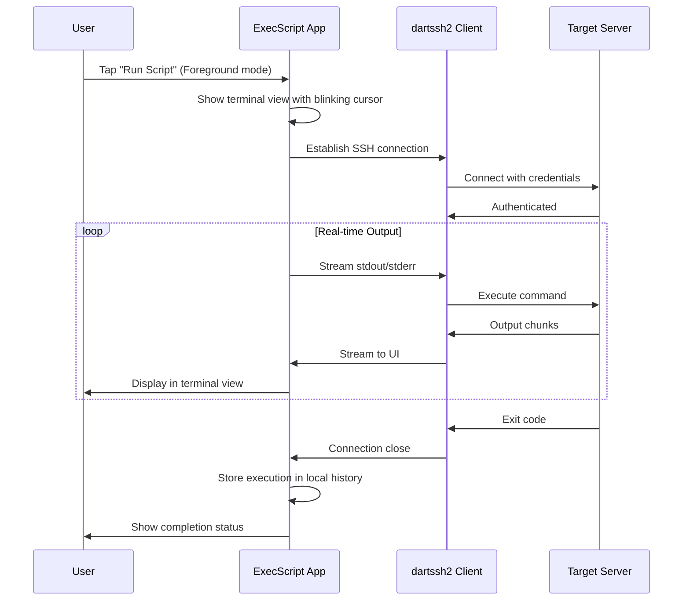
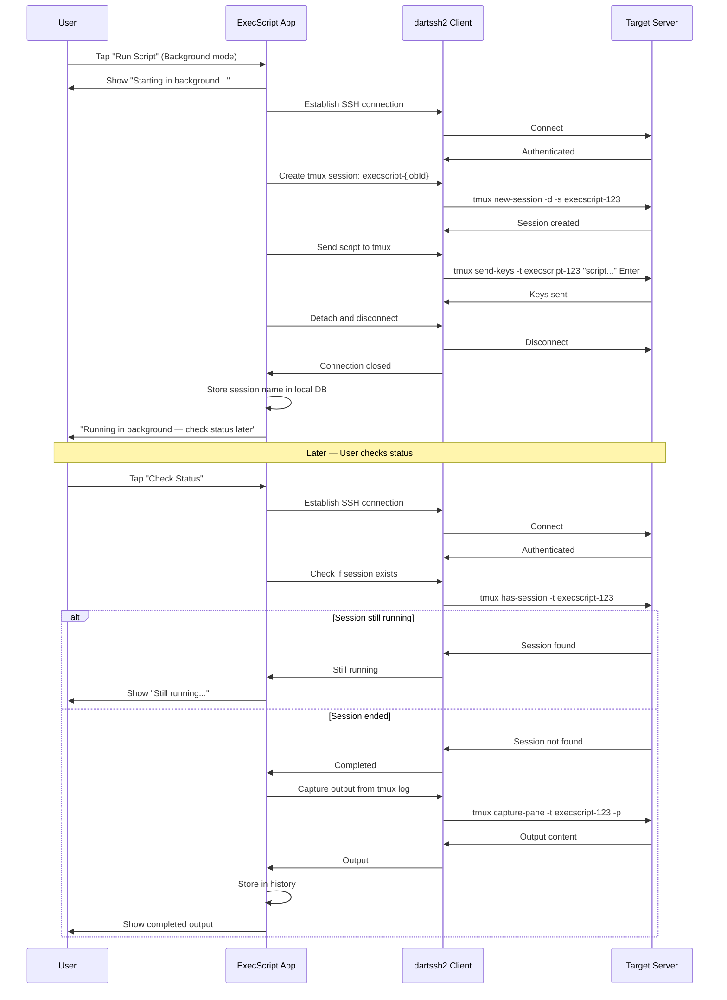

# ADR 001: ExecScript Flutter Architecture

## Status
Approved

## Date
2026-02-19

## Context

ExecScript is a **pure Flutter mobile application** for managing Linux servers via SSH. It is the spiritual successor to the legacy "Script Kitty" Android app and joins the DayOfGeek.com ecosystem alongside ExecPrompt and ExecWeb.

**Key Constraints:**
- No backend server — the mobile device connects directly to servers via SSH
- SSH connectivity is the user's responsibility (Tailscale, VPN, or direct access)
- Follows the ExecPrompt cyberpunk terminal aesthetic per `styleguide_flutter.md`
- Supports both foreground (quick) and background (tmux/screen) execution
- SQLite database stored locally on the mobile device

---

## 1. Architecture Overview

### 1.1 System Diagram

```
┌─────────────────────────────────────────────────────────────────────┐
│                        MOBILE DEVICE                                │
│  ┌─────────────────────────────────────────────────────────────┐   │
│  │                    ExecScript (Flutter)                     │   │
│  │  ┌─────────────────────────────────────────────────────┐   │   │
│  │  │  Presentation Layer                                  │   │   │
│  │  │  ├─ Server list screen                               │   │   │
│  │  │  ├─ Script library screen                            │   │   │
│  │  │  ├─ Execution terminal view                          │   │   │
│  │  │  ├─ Server configuration forms                       │   │   │
│  │  │  └─ Script editor                                    │   │   │
│  │  └─────────────────────────────────────────────────────┘   │   │
│  │  ┌─────────────────────────────────────────────────────┐   │   │
│  │  │  Domain Layer                                        │   │   │
│  │  │  ├─ ServerRepository (CRUD + connection)            │   │   │
│  │  │  ├─ ScriptRepository (CRUD + variable injection)    │   │   │
│  │  │  ├─ ExecutionService (SSH + tmux management)        │   │   │
│  │  │  └─ HistoryRepository (execution logs)              │   │   │
│  │  └─────────────────────────────────────────────────────┘   │   │
│  │  ┌─────────────────────────────────────────────────────┐   │   │
│  │  │  Infrastructure Layer                                │   │   │
│  │  │  ├─ SSHClient (dartssh2 wrapper)                    │   │   │
│  │  │  ├─ LocalDatabase (sqflite)                         │   │   │
│  │  │  ├─ CredentialVault (flutter_secure_storage)        │   │   │
│  │  │  └─ TmuxController (session management)             │   │   │
│  │  └─────────────────────────────────────────────────────┘   │   │
│  └─────────────────────────────────────────────────────────────┘   │
│                              │                                      │
│                              │ SSH (Port 22)                        │
│                              ▼                                      │
│  ┌─────────────────────────────────────────────────────────────┐   │
│  │  NETWORK (User's responsibility - Tailscale/VPN/Direct)     │   │
│  └─────────────────────────────────────────────────────────────┘   │
│                              │                                      │
│                              ▼                                      │
│  ┌──────────────┐  ┌──────────────┐  ┌──────────────┐             │
│  │  Linux       │  │  Linux       │  │  Linux       │             │
│  │  Server 1    │  │  Server 2    │  │  Server N    │             │
│  │  ├─ sshd     │  │  ├─ sshd     │  │  ├─ sshd     │             │
│  │  ├─ tmux     │  │  ├─ tmux     │  │  ├─ tmux     │             │
│  │  └─ scripts  │  │  └─ scripts  │  │  └─ scripts  │             │
│  └──────────────┘  └──────────────┘  └──────────────┘             │
└─────────────────────────────────────────────────────────────────────┘
```

### 1.2 Layer Responsibilities

| Layer | Components | Responsibility |
|-------|-----------|----------------|
| **Presentation** | Screens, Widgets, Terminal view | Cyberpunk UI per ExecPrompt styleguide, user interactions, output display |
| **Domain** | Repositories, Services, Models | Business logic, SSH operations, data transformation |
| **Infrastructure** | dartssh2, sqflite, secure storage | External connectivity, persistence, encryption |

---

## 2. Technology Stack

### 2.1 Core Dependencies

```yaml
# pubspec.yaml
name: execscript
description: Mobile server administration via SSH
publish_to: 'none'
version: 1.0.0+1

environment:
  sdk: '>=3.0.0 <4.0.0'

dependencies:
  flutter:
    sdk: flutter
  
  # SSH connectivity
  dartssh2: ^2.8.0
  
  # Local database
  sqflite: ^2.3.0
  path: ^1.8.3
  
  # Secure credential storage
  flutter_secure_storage: ^9.0.0
  
  # UI - ExecPrompt design system
  google_fonts: ^6.1.0
  
  # State management
  flutter_riverpod: ^2.4.0
  
  # Utilities
  intl: ^0.18.0

dev_dependencies:
  flutter_test:
    sdk: flutter
  build_runner: ^2.4.0
```

### 2.2 Technology Decisions

| Component | Choice | Rationale |
|-----------|--------|-----------|
| **SSH Client** | dartssh2 | Pure Dart implementation, no native dependencies, actively maintained |
| **Database** | sqflite (SQLite) | Zero external dependencies, single file, sufficient for local use |
| **Credential Storage** | flutter_secure_storage | iOS Keychain + Android Keystore, encrypted at rest |
| **State Management** | Riverpod | Lightweight, testable, reactive |
| **UI Framework** | Flutter Material + Custom | Cyberpunk terminal aesthetic per ExecPrompt styleguide |

---

## 3. Data Models

### 3.1 Server Model

```dart
class Server {
  final int? id;
  final String name;
  final String hostname;
  final int port;
  final String username;
  final AuthType authType; // password or key
  final String? keyFingerprint; // For host verification
  final String preferredShell; // tmux, screen, or none
  final List<String> tags;
  final DateTime createdAt;
  final DateTime updatedAt;
  final DateTime? lastConnected;
  
  // Credentials stored separately in secure storage
  final String? credentialKey; // Reference to secure storage key
}

enum AuthType { password, key }
```

### 3.2 Script Model

```dart
class Script {
  final int? id;
  final String name;
  final String content;
  final bool isReusable;
  final int? defaultServerId; // null if reusable
  final String? category;
  final List<ScriptVariable> variables;
  final DateTime createdAt;
  final DateTime updatedAt;
}

class ScriptVariable {
  final String name;
  final String? defaultValue;
  final bool required;
  final String? description;
}
```

### 3.3 Execution Model

```dart
class Execution {
  final int? id;
  final int serverId;
  final int scriptId;
  final ExecutionMode mode; // foreground or background
  final String? tmuxSessionName; // For background mode
  final ExecutionStatus status;
  final String? output;
  final int? exitCode;
  final DateTime startedAt;
  final DateTime? completedAt;
  final Map<String, String> variablesUsed;
}

enum ExecutionMode { foreground, background }
enum ExecutionStatus { pending, running, completed, failed, cancelled }
```

---

## 4. Execution Modes

### 4.1 Foreground Execution (Quick Tasks)

For commands that complete quickly (< 60 seconds):



**Characteristics:**
- SSH connection maintained throughout
- Real-time output streaming
- Connection lost = execution stops (user sees error)
- Good for: restarts, status checks, quick commands

### 4.2 Background Execution (Long Tasks)

For commands that take minutes (upgrades, backups, builds):



**Characteristics:**
- Tmux session created on server
- App disconnects immediately
- Job survives phone sleep, app close, network drops
- Check back anytime to see status
- Good for: apt upgrade, docker pull, long builds

---

## 5. Database Schema

```sql
-- Servers table
CREATE TABLE servers (
    id INTEGER PRIMARY KEY AUTOINCREMENT,
    name TEXT NOT NULL,
    hostname TEXT NOT NULL,
    port INTEGER DEFAULT 22,
    username TEXT NOT NULL,
    auth_type TEXT NOT NULL CHECK (auth_type IN ('password', 'key')),
    credential_key TEXT NOT NULL, -- Reference to secure storage
    key_fingerprint TEXT, -- For host key verification
    preferred_shell TEXT DEFAULT 'tmux' CHECK (preferred_shell IN ('tmux', 'screen', 'none')),
    tags TEXT, -- JSON array
    created_at TEXT NOT NULL,
    updated_at TEXT NOT NULL,
    last_connected TEXT
);

-- Scripts table
CREATE TABLE scripts (
    id INTEGER PRIMARY KEY AUTOINCREMENT,
    name TEXT NOT NULL,
    content TEXT NOT NULL,
    is_reusable INTEGER DEFAULT 0,
    default_server_id INTEGER,
    category TEXT,
    variables TEXT, -- JSON: [{"name": "VAR", "default": "", "required": true}]
    created_at TEXT NOT NULL,
    updated_at TEXT NOT NULL,
    FOREIGN KEY (default_server_id) REFERENCES servers(id) ON DELETE SET NULL
);

-- Executions table (history)
CREATE TABLE executions (
    id INTEGER PRIMARY KEY AUTOINCREMENT,
    server_id INTEGER NOT NULL,
    script_id INTEGER NOT NULL,
    mode TEXT NOT NULL CHECK (mode IN ('foreground', 'background')),
    tmux_session_name TEXT,
    status TEXT NOT NULL CHECK (status IN ('pending', 'running', 'completed', 'failed', 'cancelled')),
    output TEXT,
    exit_code INTEGER,
    variables_used TEXT, -- JSON
    started_at TEXT NOT NULL,
    completed_at TEXT,
    FOREIGN KEY (server_id) REFERENCES servers(id) ON DELETE CASCADE,
    FOREIGN KEY (script_id) REFERENCES scripts(id) ON DELETE SET NULL
);

-- Indexes
CREATE INDEX idx_executions_server ON executions(server_id);
CREATE INDEX idx_executions_script ON executions(script_id);
CREATE INDEX idx_executions_status ON executions(status);
CREATE INDEX idx_executions_started ON executions(started_at);
CREATE INDEX idx_servers_name ON servers(name);
```

---

## 6. Security Architecture

### 6.1 Credential Storage Flow

```
┌─────────────────────────────────────────────────────────┐
│           Credential Storage Flow                        │
├─────────────────────────────────────────────────────────┤
│                                                          │
│  1. User enters password or private key in app          │
│                                                          │
│  2. App stores in secure storage:                       │
│     - iOS: Keychain (kSecClassGenericPassword)          │
│     - Android: EncryptedSharedPreferences (Keystore)    │
│                                                          │
│  3. SQLite stores reference key only                    │
│     (credential_key field in servers table)             │
│                                                          │
│  4. For SSH connection:                                 │
│     - Retrieve from secure storage using key            │
│     - Pass to dartssh2 (never logged)                   │
│     - Clear from memory after use                       │
│                                                          │
└─────────────────────────────────────────────────────────┘
```

### 6.2 SSH Security Configuration

```dart
final client = SSHClient(
  await SSHSocket.connect(server.hostname, server.port),
  username: server.username,
  
  // Authentication
  identities: server.authType == AuthType.key 
    ? [SSHKeyPair.fromOpenSSH(privateKey, passphrase: passphrase)]
    : null,
  password: server.authType == AuthType.password 
    ? password 
    : null,
  
  // Host key verification (important!)
  acceptedHostHashes: server.keyFingerprint != null 
    ? [server.keyFingerprint!] 
    : null,
  
  // Connection timeouts
  keepaliveInterval: Duration(seconds: 30),
  keepaliveMaxFailures: 3,
);
```

### 6.3 Security Checklist

| Threat | Mitigation |
|--------|-----------|
| **Credential theft (device lost)** | Biometric lock option; encrypted in Keystore/Keychain |
| **Man-in-the-middle** | Host key verification; warn on unknown hosts |
| **Command injection** | Parameterized scripts; escape shell variables |
| **Screen shoulder-surfing** | Auto-lock; mask sensitive fields |
| **Backup exposure** | Optional encrypted export with user password |

---

## 7. UI/UX Design

Following the ExecPrompt cyberpunk terminal aesthetic from `styleguide_flutter.md`:

### 7.1 Main Screens

1. **Home/Dashboard** — Server list + Recent executions
2. **Server Detail** — Server info + Server-specific scripts + Run history
3. **Script Library** — All scripts (reusable + server-specific)
4. **Script Editor** — Create/edit scripts with variable definition
5. **Execution Terminal** — Real-time output with blinking cursor
6. **Background Jobs** — List of running background executions
7. **Settings** — Theme selection, security options, export/backup

### 7.2 Terminal Execution View

```
┌─────────────────────────────────────────────────────────┐
│  ‹ BACK    WEB-01: Update System            [⚡] [⏹]   │
├─────────────────────────────────────────────────────────┤
│                                                         │
│  ┌─────────────────────────────────────────────────┐   │
│  │                                                 │   │
│  │  [SYS] 14:32:01 Starting execution...           │   │
│  │                                                 │   │
│  │  $ apt update && apt upgrade -y                 │   │
│  │                                                 │   │
│  │  Hit:1 http://archive.ubuntu.com focal InRelease│   │
│  │  Get:2 http://archive.ubuntu.com focal-updates  │   │
│  │  Fetched 12.4 MB in 3s (3892 kB/s)              │   │
│  │  ...                                            │   │
│  │                                                 │   │
│  │  █  <-- Blinking cursor                         │   │
│  │                                                 │   │
│  └─────────────────────────────────────────────────┘   │
│                                                         │
│  [Foreground mode — disconnect will cancel]             │
│                                                         │
└─────────────────────────────────────────────────────────┘
```

### 7.3 Color Palette (ExecPrompt Style)

Following the P1 Green (Classic Terminal) theme:

```dart
class CyberTermColors {
  static const background = Color(0xFF0A0F0A);
  static const surface = Color(0xFF0F1A0F);
  static const primary = Color(0xFF33FF33);
  static const primaryDim = Color(0xFF1A801A);
  static const textColor = Color(0xFF33FF33);
  static const textDim = Color(0xFF66FF66);
  static const accent = Color(0xFF66FF66);
  static const error = Color(0xFFFF3333);
  static const border = Color(0xFF1A3A1A);
}
```

---

## 8. Project Structure

```
execscript/
├── android/                    # Android-specific
├── ios/                        # iOS-specific
├── lib/
│   ├── main.dart              # Entry point
│   ├── app.dart               # MaterialApp configuration
│   │
│   ├── core/                  # Core utilities
│   │   ├── constants.dart
│   │   ├── theme.dart         # Cyberpunk theme (ExecPrompt style)
│   │   └── extensions.dart
│   │
│   ├── data/                  # Data layer
│   │   ├── database.dart      # sqflite setup
│   │   ├── models/
│   │   │   ├── server.dart
│   │   │   ├── script.dart
│   │   │   └── execution.dart
│   │   └── repositories/
│   │       ├── server_repository.dart
│   │       ├── script_repository.dart
│   │       └── execution_repository.dart
│   │
│   ├── services/              # Business logic
│   │   ├── ssh_service.dart   # dartssh2 wrapper
│   │   ├── tmux_service.dart  # Tmux session management
│   │   └── credential_service.dart
│   │
│   ├── presentation/          # UI layer
│   │   ├── providers/         # Riverpod providers
│   │   ├── screens/
│   │   │   ├── home_screen.dart
│   │   │   ├── servers_screen.dart
│   │   │   ├── scripts_screen.dart
│   │   │   ├── execution_screen.dart
│   │   │   └── settings_screen.dart
│   │   ├── widgets/
│   │   │   ├── terminal_view.dart
│   │   │   ├── server_card.dart
│   │   │   ├── script_card.dart
│   │   │   └── cyberpunk_components.dart
│   │   └── forms/
│   │       ├── server_form.dart
│   │       └── script_form.dart
│   │
│   └── router.dart            # Navigation
│
├── test/                      # Unit & widget tests
├── docs/                      # Documentation
│   └── adr/
│       └── 001-execscript-flutter-architecture.md
├── pubspec.yaml
└── README.md
```

---

## 9. Service Interfaces

### 9.1 SSH Service

```dart
abstract class SSHService {
  /// Connect to a server
  Future<SSHSession> connect(Server server);
  
  /// Execute command in foreground (streaming)
  Stream<SSHOutput> executeStream(
    SSHSession session,
    String command, {
    Duration timeout = const Duration(minutes: 5),
  });
  
  /// Execute command once (returns when complete)
  Future<SSHResult> execute(
    SSHSession session,
    String command, {
    Duration timeout = const Duration(minutes: 5),
  });
  
  /// Disconnect
  Future<void> disconnect(SSHSession session);
}
```

### 9.2 Tmux Service

```dart
abstract class TmuxService {
  /// Create a new tmux session for background execution
  Future<String> createSession(SSHSession session, {String? name});
  
  /// Send command to tmux session
  Future<void> sendCommand(SSHSession session, String sessionName, String command);
  
  /// Check if session is still running
  Future<bool> isSessionActive(SSHSession session, String sessionName);
  
  /// Capture output from session
  Future<String> captureOutput(SSHSession session, String sessionName);
  
  /// Kill a session
  Future<void> killSession(SSHSession session, String sessionName);
}
```

---

## 10. Decisions Summary

| Decision | Choice | Trade-off |
|----------|--------|-----------|
| **Platform** | Flutter (iOS + Android) | Single codebase vs native performance |
| **SSH Library** | dartssh2 | Pure Dart vs native bindings |
| **Database** | sqflite (SQLite) | Local storage vs no sync between devices |
| **Credentials** | flutter_secure_storage | Platform Keystore vs custom encryption |
| **State Management** | Riverpod | Learning curve vs power |
| **Background Tasks** | Tmux on server | Survives disconnects vs requires tmux |
| **Design** | Cyberpunk terminal (ExecPrompt) | Distinctive vs conventional |

---

## 11. Risks & Mitigations

| Risk | Impact | Mitigation |
|------|--------|-----------|
| dartssh2 limitations | Medium | Test thoroughly; fallback to password auth if key issues |
| Tmux not on server | Medium | Auto-detect and offer to use screen or install tmux |
| Large output handling | Low | Stream to temp file if > 100KB |
| Network timeouts | Low | Configurable timeouts; clear error messages |
| Device loss | Low | Biometric lock; encrypted credentials |

---

## 12. Future Considerations

| Feature | Priority | Notes |
|---------|----------|-------|
| iPad optimization | Medium | Two-column layout |
| Script templates | Medium | Pre-built common tasks |
| Execution scheduling | Low | Requires background processing |
| Export/sync | Low | Encrypted backup to cloud |

---

## References

- [ExecPrompt Flutter Style Guide](../execprompt/docs/styleguide_flutter.md)
- [dartssh2 Documentation](https://pub.dev/packages/dartssh2)
- [sqflite Documentation](https://pub.dev/packages/sqflite)
- [flutter_secure_storage](https://pub.dev/packages/flutter_secure_storage)
